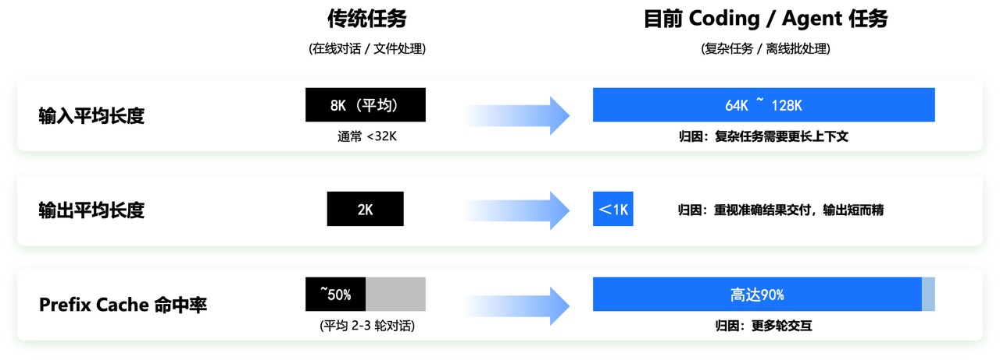
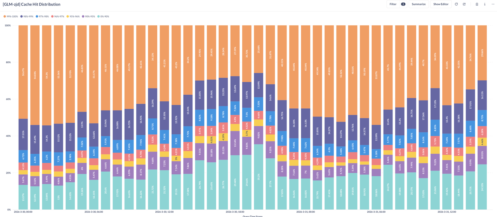
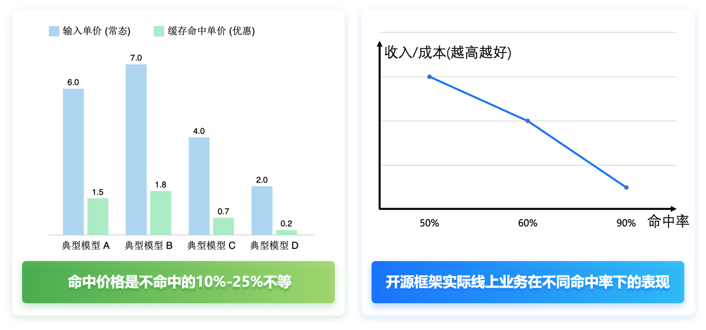
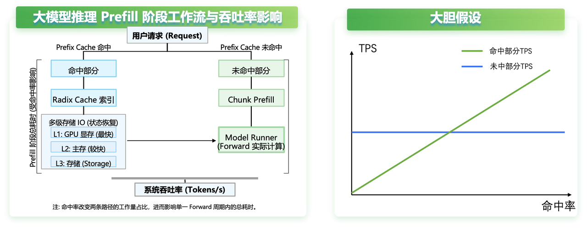
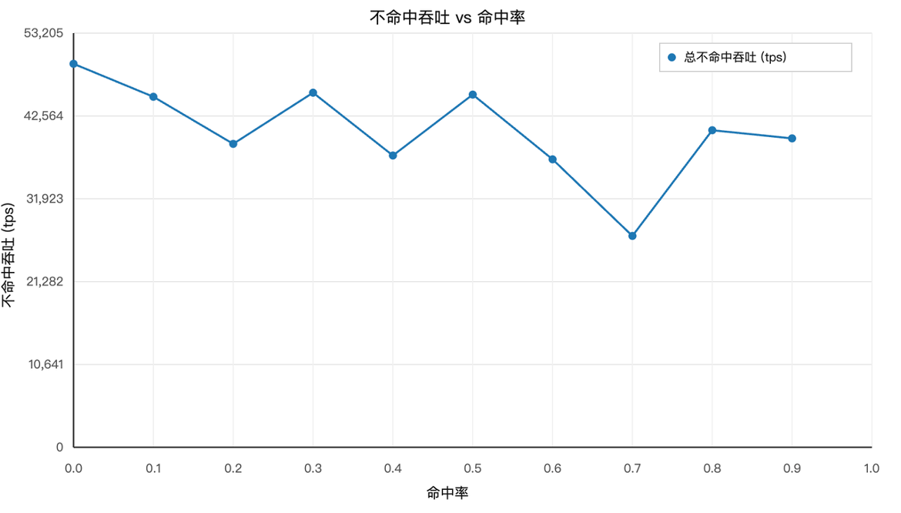
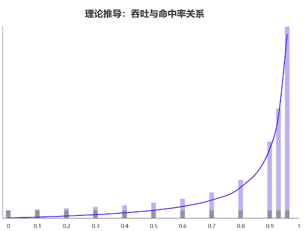
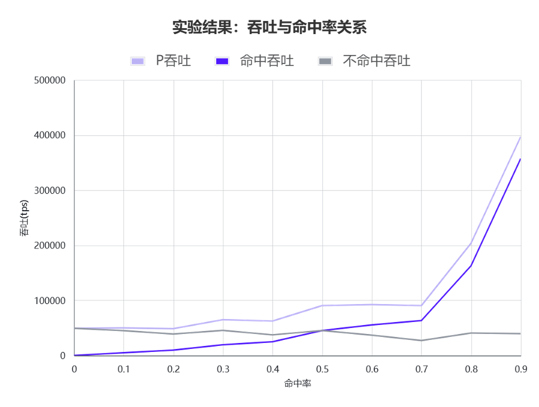

## 1. KV Cache命中率高达90%以上

2025年至今，大模型推理场景经历了从对话场景到Coding等Agent场景的变化。从大模型推理的工作负载角度来看，长文本、高Prefix KV Cache命中率和短输出成为了Agent推理阶段的新特征。传统任务，以在线对话/文件处理为主，输入平均8K，通常不超过32K，输出平均2K，KV Cache命中率50%（平均2-3轮对话）。目前的Agent任务，输入长度可以达到平均64K~128K，输出一般在1K以内，KV Cache命中率高达90%。这是因为复杂任务需要更长的上下文（输入长），更多轮的交互（KV Cache命中率高），更重视准确结果交付（输出短而准确）。

  

下图是某个服务在3月份某一天，请求KV Cache命中率的分布情况，我们发现在流量较低的时间段，比如凌晨2点，甚至有高达50%的请求，KV Cache命中率超过了99%，而平均命中率也可以达到80%-90%。

  

如此高的KV Cache命中率意味着请求中大量的Token不需要计算，只需要计算很小一部分，那么对于大模型推理厂商而言，钱也赚的太容易了吧，那么真实情况是这样么？

## 2. 命中越高越亏钱？
然而我们分析了历史业务中的命中率变化在开源框架上的表现，发现了一个非常“反直觉”的发现，如下图所示，随着KV Cache命中率提升，反而更亏钱了。

  

因为目前大模型的输入部分KV Cache命中和未命中部分的价格不一致，大概命中部分的价格是未命中部分的10%-25%不等。那么，命中率越高越亏钱，那就是说明命中带来的吞吐收益，抵不过KV Cache命中部分的极低折扣？

## 3. KV Cache命中率的浴盆模型
接下来让我们对KV Cache命中率作为核心变量的收入模型进行一波量化分析。首先，给定一组机器的服务，每秒的收入由以下公式算得，其中TPD代表该服务每天支持的Token总数即Token per Day，其中分为hit和miss两部分，分别代表命中KV Cache的Token per Day和未命中部分的Token per Day。考虑到每秒的成本属于固定机器成本，不随KV Cache命中率变化。因此，收入/成本主要受下述公式影响。
$$
(TPD^{hit} ∗Price^{hit}+TPD^{miss}∗Price^{miss})/(3600∗24)
$$
上述公式可以简化为推理服务KV Cache命中部分和未命中部分的吞吐率，因此这两部分$TPS$随着KV Cache命中率的变化成为性价比的关键。
$$
TPS^{hit} ∗Price^{hit}+TPS^{miss}∗Price^{miss}
$$

### 3.1 大胆假设
我们不妨大胆假设，$TPS^{miss}$ 不受命中率影响，而$TPS^{hit}$随着命中率提升而提升，如下图所示：

  

### 3.2 小心求证
接下来，让我们开始小心求证。首先，我们使用某个真实模型，人造出不同KV Cache命中率的数据，然后实测了不同KV Cache命中率下，$TPS^{miss}$ 的变化过程：

  

我们发现随着KV Cache命中率提升，$TPS$存在几个奇异点，即20%、40%、70%命中率下$TPS$很低。我们分析代码发现是这几个命中率下，框架在调度过程中会出现一些很小的需要计算的Chunk，即末尾残块（Tail Chunk），其大小会随命中率变化。若不满 Chunk Size 又无法拼接，需独立计算。末尾残块越小，$TPS$越差。我们可以通过工程优化进行优化处理。除掉奇异点之后，我们小心求证得到，未命中部分的吞吐随着KV Cache命中率提升，呈近似线性下降。

搞定$TPS$^{miss}$，我们再分析$TPS^{hit}$随着KV Cache命中率提升的变化，我们首先做一个数学建模，如下图所示，我们发现$TPS^{hit}$随着KV Cache命中率遵循双曲线函数$(1-x)/x$。

#### 变量定义

| 符号 | 含义 | 单位 |
|---------|-----------|-----------|
| $L$ | 输入长度 | $tokens$ |
| $x$ | 命中率 | [0,1] |
| $TPS^{hit}$ | 未命中部分吞吐率 | $tokens/s$ |
| $t$ | 请求执行时间 | $s$ |
| $TPS^{total}$ | 总系统吞吐率 | $tokens/s$ |
| $TPS^{hit}$ | 命中部分吞吐率 | $tokens/s$ |
| $TPS^{miss}$ | 未命中部分吞吐率 | $tokens/s$ |

#### 推导过程

$$
N_{total} = L
$$
$$
N_{hit} = x * L
$$
$$
N_{miss} =(1-x) * L
$$
$$
t = \frac{N_{miss}}{TPS^{hit}} = \frac{(1-x)L}{TPS^{hit}}
$$
$$
TPS^{total} = \frac{N_{total}}{TPS^{hit}} = \frac{L}{\frac{(1-x)L}{TPS^{hit}}} = \frac{t}{1-x}
$$

$$
TPS^{hit} = \frac{N_{hit}}{T} = \frac{xL}{\frac{(1-x)L}{TPS^{hit}}} = \frac{x}{1-x}*TPS^{hit}
$$

结论为双曲线：

  

理论分析之后，我们同样通过实验进行验证，我们使用某个真实模型，人造出不同KV Cache命中率的数据，然后实测了不同KV Cache命中率下，$TPS^{hit}$的变化过程基本吻合双曲线。

  

### 3.3 浴盆模型

我们发现以上图来看，当命中率从40%提高到70%时，未命中部分$TPS$下降了接近20%，而命中部分的吞吐率提升不超过3倍。考虑到命中部分的价格只有未命中部分的10%-25%，显然命中率提升之后，更亏钱了。我们通过建模和实测给出了命中越高越亏钱这个反直觉发现的背后玄机，即随着命中率变化，收益呈现出一个浴盆曲线的变化。当我们落入在偶然失效区间时，就会出现命中率越高越亏钱。

  

## 4. 未来的核心优化方向 —— Stay Away From the Valley
体系结构领域有一篇著名的论文比较SIMT和SIMD架构，Many-Core vs. Many-Thread Machines: Stay Away From the Valley，和这里有异曲同工之妙，我们也借用Stay Away From The Valley的描述，来给出一些我们认为的优化方向：
- 通过系统优化，把浴盆变浅，一是降低上图中未命中部分下降的斜率，而是提升命中部分上升的斜率。
- 提高KV Cache容量，逃离盆底，让实际命中率更高更稳定。